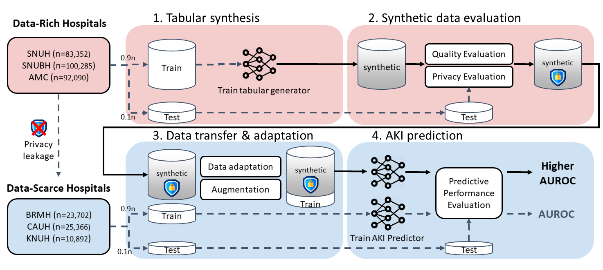

# PS-AKI-Predict

**Privacy-preserving Synthetic Data for Postoperative Acute Kidney Injury Prediction in Data-Scarce Clinical Settings: A Multicenter Modeling Study** *(under review)*

## Abstract

Background: Despite the growing adoption of artificial intelligence (AI) in healthcare, data scarcity and privacy concerns continue to limit its clinical application. This study aims to develop and validate a synthetic data generation model as a promising solution, enabling accurate prediction of post-operative acute kidney injury (PO-AKI) even with limited real-world datasets.

Methods: We developed a synthetic generative AI model to create virtual patient data incorporating comorbidities, laboratory results, medication history, surgical details, and PO-AKI outcomes in patients undergoing non-cardiac major surgeries. The model was trained on real-world data from data-rich hospitals. Privacy risks were assessed through Membership and Attribute Inference Attacks (MIA and AIA). We statistically evaluated the similarity between synthetic and real-world data, and assessed clinical utility by augmenting data-scarce cohorts with matched synthetic data to improve PO-AKI prediction using CatBoost.

Findings: We collected data from 335,687 patients across six tertiary hospitals, comprising 275,727 patients from three data-rich sites and 59,960 patients from three data-scarce sites. Synthetic data generated from the data-rich hospitals showed high similarity to the real-world datasets, with no significant differences in 89.0–94.4% of variables across sites. Privacy assessments revealed no evidence of data leakage through MIA and AIA. For PO-AKI prediction, the benefit was most pronounced in smaller cohorts, peaking at 2,000–4,000 synthetic patients and plateauing beyond 16,000 (with augmentation up to 32,000 patients tested). Feature importance rankings showed high concordance between models trained on real and synthetic datasets, further validating the reliability of synthetic data.

Interpretation: This is the first study to apply generative AI to PO-AKI prediction. We comprehensively demonstrate its clinical utility in data-scarce scenarios by enhancing prediction performance through synthetic data augmentation.



## Quick Start

### 1. Data Preprocessing

Run preprocessing for each hospital study. This will automatically generate JSON configs in the `configs/` directory:

```bash
bash run_scripts/preprocess.sh
```

Or run manually:
```bash
python mmtg/datamodules/preprocess.py \
  --input_path /path/to/input \
  --patient_data_filename your_data.xlsx \
  --study SNUH \
  --output_path /path/to/output
```

### 2. Model Training

Train the model for a specific hospital study:

```bash
python main.py with task_train_table2table study=SNUH seed=2020
```

Or use the training script:
```bash
bash run_scripts/train.sh
```

### 3. Data Generation

Generate synthetic tabular data:
```bash
bash run_scripts/generate.sh
```

## Configuration System

### Hospital-Specific Settings

Hospital-specific configurations (column orders, vocabulary sizes, etc.) are now automatically loaded from JSON files in the `configs/` directory:

- `configs/SNUH.json` - SNUH hospital config
- `configs/SNUBH.json` - SNUBH hospital config
- `configs/BRMH.json` - BRMH hospital config
- ... (and more)

These configs are generated automatically when you run preprocessing.

### Available Named Configs

- `task_train_table2table` - Train on tabular data only
- `task_train_both2table` - Train on tabular + text data
- `task_test_table2table` - Test/inference mode
- `task_test_both2table` - Test with text + tabular

All configs accept a `study` parameter to specify the hospital (e.g., `study=SNUH`, `study=SNUBH`).

## License

This project is licensed under the MIT License - see the [LICENSE](LICENSE) file for details.
